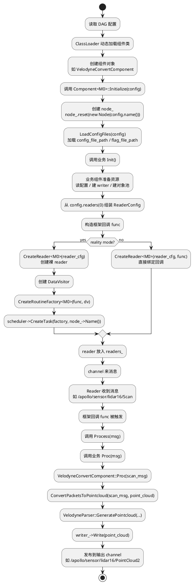

# `component.h` 单输入 `Initialize()` 详解

本文专门讲 `cyber/component/component.h` 里 **单输入 component** 的 `Initialize()` 实现，也就是这一段：

- `Component<M0, NullType, NullType, NullType>::Initialize(const ComponentConfig& config)`

目标不是只做源码翻译，而是把下面这件事讲透：

> CyberRT 是怎样把一个“继承了 `Component<M0>` 的业务类”，从 DAG 配置装配成一个真正会订阅 channel、会在消息到来时自动执行 `Proc(msg)` 的运行单元？

如果你已经看过 `drivers/lidar` 的 `VelodyneConvertComponent`，那么这篇文档就是在回答它背后的框架问题：

- 为什么它只写 `Init()` 和 `Proc()` 就能跑起来？
- reader 是谁创建的？
- `Proc()` 是谁调用的？
- scheduler / DataVisitor 又是在什么时候接进来的？

---

## 1. 先建立整体模型

在单输入 component 模式下，业务类通常长这样：

```cpp
class SomeComponent : public Component<MsgType> {
 public:
  bool Init() override;
  bool Proc(const std::shared_ptr<MsgType>& msg) override;
};
```

DAG 里则会给它配：

- `module_library`
- `class_name`
- `config_file_path`
- `readers { channel: ... }`

从框架视角，这一整套东西要完成的是下面这条链：

```text
DAG 配置
  -> 动态加载组件类
  -> 调用 Component<M0>::Initialize(config)
  -> 创建 node
  -> 加载配置文件
  -> 调用业务 Init()
  -> 创建 reader
  -> 包装回调
  -> 接入 DataVisitor / Scheduler
  -> channel 来消息
  -> Process(msg)
  -> Proc(msg)
```

所以 `Initialize()` 的职责，不是简单做“初始化变量”，而是：

> **把一个 C++ 业务类正式装配成一个可运行的 CyberRT 消息组件。**

---

## 2. 先看这段代码到底做了哪些大步骤

单输入版本的核心实现大致是：

1. 创建 `node_`
2. 加载配置文件和 flag 文件
3. 检查 DAG 里是否至少配置了一个 reader
4. 调业务组件自己的 `Init()`
5. 从 `config.readers(0)` 组装 `ReaderConfig`
6. 构造一个框架回调 `func`
7. 创建 `Reader<M0>`
8. 把 reader 放入 `readers_`
9. 如果是 reality mode，再接上 `DataVisitor + RoutineFactory + Scheduler`

这九步里，前四步是在“启动组件”，中间三步是在“接线 reader”，最后一步是在“接入调度系统”。

理解了这个骨架，再回头逐行看源码就不会散。

---

## 3. 代码块一：创建 `node_`

对应代码：

```cpp
node_.reset(new Node(config.name()));
```

### 3.1 这一行做了什么

它给当前 component 创建了一个自己的 Cyber node。

这个 `node_` 不是业务类自己 new 的，而是框架在 `Initialize()` 里统一创建的。后面业务类在 `Init()` 里能直接写：

```cpp
node_->CreateWriter<...>(...)
node_->CreateReader<...>(...)
```

就是因为这里已经准备好了。

### 3.2 为什么 component 必须有自己的 node

因为在 CyberRT 里，reader / writer / service / client 这些通信对象都不是悬空存在的，它们都挂在某个 node 上。

所以从框架设计看，component 不是直接拥有若干 reader/writer，而是先拥有：

- 一个 `node_`

然后再通过这个 `node_` 去创建通信端点。

### 3.3 `config.name()` 的意义

这里传入的是 DAG 配置中的 `config.name`。也就是说，component 的 node 名字来自 DAG，而不是类名本身。

这点很重要，因为：

- 类名表示“代码类型”
- `config.name` 表示“运行实例名”

一个类理论上可以在不同 DAG 里实例化成多个不同名字的运行节点。

---

## 4. 代码块二：加载配置文件

对应代码：

```cpp
LoadConfigFiles(config);
```

### 4.1 这一行实际干了什么

它会去处理 DAG 里传入的：

- `config_file_path`
- `flag_file_path`

对应逻辑在 `ComponentBase` 的 [component_base.h](/home/zkm/CyberRT-10.0.0/cyber/component/component_base.h:72) 里。

它会：

1. 解析配置文件真实路径
2. 把解析结果保存到 `config_file_path_`
3. 如果有 flag 文件，也会一起加载

### 4.2 为什么这里不直接读 proto

因为框架先做的是“配置路径装配”，不是“具体业务配置解析”。

业务组件真正读取自己的 proto 配置，通常是在自己的 `Init()` 里通过：

```cpp
GetProtoConfig(&my_config)
```

来做。

所以这里的分工是：

- 框架层：准备好配置文件路径
- 业务层：决定如何解释这份配置

这也是 component 框架一个很清晰的边界。

---

## 5. 代码块三：检查 reader 数量是否合法

对应代码：

```cpp
if (config.readers_size() < 1) {
  AERROR << "Invalid config file: too few readers.";
  return false;
}
```

### 5.1 为什么这里要检查

因为这是 **单输入 component** 的模板特化版本。

它的语义已经固定了：

- 这个组件必须至少有一路输入消息

如果 DAG 没有给它配置 reader，它就不可能成为一个“消息驱动组件”。那继续初始化也没有意义。

### 5.2 这行检查表达了框架的什么思想

这不是业务校验，而是 **模板语义校验**。

也就是说，框架把 `Component<M0>` 的含义理解为：

> “必须至少有一个 reader，且这个 reader 对应 `M0`。”

所以多输入版本里你也会看到类似检查：

- `Component<M0, M1>` 要求 `readers_size() >= 2`
- `Component<M0, M1, M2>` 要求 `readers_size() >= 3`

这里的 reader 数量检查，本质上是在保证 DAG 配置和组件模板签名一致。

---

## 6. 代码块四：先调用业务 `Init()`

对应代码：

```cpp
if (!Init()) {
  AERROR << "Component Init() failed.";
  return false;
}
```

### 6.1 为什么框架先调 `Init()`，再创建 reader

这是 component 框架里一个很值得注意的设计顺序。

它选择先让业务类完成自己的初始化，再进入 reader 装配阶段。

原因通常有几个：

1. 业务组件可能要先读配置
2. 业务组件可能要先创建 writer
3. 业务组件可能要先准备内部算法对象、缓存、对象池
4. 如果业务组件本身初始化失败，就不应该继续接入消息链路

也就是说，框架认为：

> “先确认你这个组件自己站得住，再把外部消息接进来。”

### 6.2 这意味着什么

这意味着业务组件的 `Init()` 里可以放心依赖：

- `node_` 已经存在
- `config_file_path_` 已经准备好

所以像你前面看过的 `VelodyneConvertComponent::Init()` 才能直接做：

- `GetProtoConfig(&velodyne_config)`
- `node_->CreateWriter<PointCloud>(...)`
- 创建对象池

而 reader 这时还没有真正接入，避免了“消息已经进来，但组件内部资源还没准备好”的竞态问题。

---

## 7. 代码块五：判断是否是 reality mode

对应代码：

```cpp
bool is_reality_mode = GlobalData::Instance()->IsRealityMode();
```

### 7.1 这一行控制什么分支

它决定后面 reader 和执行模型是走：

1. **Reality mode**
走 DataVisitor + 协程调度器的正式运行路径

2. **非 reality mode**
更直接地把 callback 绑在 reader 上

### 7.2 为什么框架要区分两种模式

因为 CyberRT 并不总是运行在完整的“真实调度环境”里。

在某些测试或非真实模式下，框架可以简化掉一部分调度层，把 reader callback 直接绑上去；而在真实运行模式下，则希望通过：

- `DataVisitor`
- `RoutineFactory`
- `Scheduler`

把 component 真正纳入 CyberRT 的协程调度体系。

所以这行代码看似普通，实际上是后续“直接回调”还是“调度器驱动”的总开关。

---

## 8. 代码块六：从 DAG 读出 `ReaderConfig`

对应代码：

```cpp
ReaderConfig reader_cfg;
reader_cfg.channel_name = config.readers(0).channel();
reader_cfg.qos_profile.CopyFrom(config.readers(0).qos_profile());
reader_cfg.pending_queue_size = config.readers(0).pending_queue_size();
```

### 8.1 这段代码在干什么

这一步把 DAG 配置里的第一路 reader，转换成代码里真正可用于创建 reader 的 `ReaderConfig`。

也就是说，DAG 里写的是声明式配置：

- channel 是什么
- qos 是什么
- pending queue 多大

而这里把它翻译成运行时对象。

### 8.2 为什么只取 `readers(0)`

因为这是单输入模板版本，也就是 `Component<M0>`。

它的语义就是：

- 我只关心第一路 reader

多输入版本才会继续去取 `readers(1)`、`readers(2)` 等。

### 8.3 这一段很关键的认识

很多人第一次看 DAG 会把 `readers` 当成“文档说明”。其实不是。这里已经证明：

> DAG 里的 `readers` 最终会直接变成真正的 `ReaderConfig`，驱动代码里的 reader 创建行为。

所以 DAG 不只是配置清单，而是真正的运行接线图。

---

## 9. 代码块七：构造统计用的 `role_attr`

对应代码：

```cpp
auto role_attr = std::make_shared<proto::RoleAttributes>();
role_attr->set_node_name(config.name());
role_attr->set_channel_name(config.readers(0).channel());
```

### 9.1 它不是 reader 本身

这块容易误解。这里构造的不是 reader，也不是 writer，而是一份角色属性描述对象。

它记录的是：

- 当前 component/node 名字
- 当前输入 channel 名字

### 9.2 这份属性后面用来做什么

后面的回调里会用它做统计采样：

- `SamplingProcLatency`
- `SamplingCyberLatency`

也就是说，框架在装配 component 的时候，不只是把消息接进来，还顺带把“性能统计的身份信息”一起准备好了。

这体现的是 CyberRT 的工程化思路：

> component 不是只负责能跑，还要能被监控、能被统计。

---

## 10. 代码块八：构造框架回调 `func`

对应代码：

```cpp
std::weak_ptr<Component<M0>> self =
    std::dynamic_pointer_cast<Component<M0>>(shared_from_this());
auto func = [self, role_attr](const std::shared_ptr<M0>& msg) {
  auto start_time = Time::Now().ToMicrosecond();
  auto ptr = self.lock();
  if (ptr) {
    ptr->Process(msg);
  } else {
    AERROR << "Component object has been destroyed.";
  }
  auto end_time = Time::Now().ToMicrosecond();
  ...
};
```

这一段是整段 `Initialize()` 里最核心的部分之一。

### 10.1 为什么要先拿 `weak_ptr self`

component 是由框架托管的对象，回调可能在未来某个时刻才被触发。如果 lambda 里直接强持有 `shared_ptr`，就可能导致生命周期循环引用或者 shutdown 时对象难以释放。

所以这里用：

- `shared_from_this()`
- 再转成 `weak_ptr`

运行时真正执行回调时再 `lock()` 一次。

意思就是：

> 如果组件对象还活着，就处理消息；如果已经销毁，就不要再访问它。

这是很标准、很安全的异步回调写法。

### 10.2 为什么回调里不是直接调 `Proc(msg)`，而是调 `Process(msg)`

因为 `Process()` 是框架门面，里面会先检查：

- `is_shutdown_`

然后才调业务 `Proc(msg)`。

这保证了 shutdown 状态下不会再继续跑业务逻辑。

### 10.3 这段回调还做了什么额外工作

除了调用 `Process(msg)`，它还会记录：

- 处理耗时 `ProcLatency`
- 从框架处理状态里拿到起点时间，再采样 `CyberLatency`

这再次说明：

> component 的消息回调不是“纯业务回调”，而是“业务逻辑 + 框架统计”的组合入口。

---

## 11. 代码块九：真正创建 `Reader<M0>`

对应代码：

```cpp
std::shared_ptr<Reader<M0>> reader = nullptr;

if (cyber_likely(is_reality_mode)) {
  reader = node_->CreateReader<M0>(reader_cfg);
} else {
  reader = node_->CreateReader<M0>(reader_cfg, func);
}
```

### 11.1 这段最容易产生的误解

很多人会以为：

- reader 创建时一定直接绑定业务回调

但这里其实分两种情况。

### 11.2 非 reality mode

在非真实模式下，reader 创建时就直接把 `func` 绑上了：

```cpp
CreateReader<M0>(reader_cfg, func)
```

这意味着消息到了 reader，就会直接进入这个回调。

### 11.3 reality mode

在真实模式下，这里反而只创建一个“裸 reader”：

```cpp
CreateReader<M0>(reader_cfg)
```

也就是说，**正式运行模式下，消息处理不会简单靠 reader callback 直接驱动**。

后面还要再通过：

- `DataVisitor`
- `RoutineFactory`
- `Scheduler`

把它接入协程任务体系。

这一步非常关键，因为它揭示了 CyberRT 的一个核心设计：

> reader 负责收消息，但业务 component 的执行并不一定直接在 reader 回调线程里完成。

---

## 12. 代码块十：把 reader 纳入 `readers_`

对应代码：

```cpp
if (reader == nullptr) {
  AERROR << "Component create reader failed.";
  return false;
}
readers_.emplace_back(std::move(reader));
```

### 12.1 为什么要保存到 `readers_`

因为 component 关闭时，`ComponentBase::Shutdown()` 需要统一清理所有 reader：

- 调 `reader->Shutdown()`
- 从 scheduler 移除任务

所以 `readers_` 不是临时容器，而是 component 生命周期管理的一部分。

### 12.2 为什么这是框架级容器，不是业务自己存

因为 reader 是框架根据 DAG 自动创建的，不是业务组件自己手工 new 的。

既然框架负责创建，那框架也要负责统一管理它们的关闭和资源回收。

这也是 component 模式和“自己在业务代码里随手建 reader”的一个大区别。

---

## 13. 代码块十一：非 reality mode 这里就结束了

对应代码：

```cpp
if (cyber_unlikely(!is_reality_mode)) {
  return true;
}
```

### 13.1 这意味着什么

这说明在非 reality mode 下，到前面为止组件已经可以工作了：

- reader 已经创建
- callback 已经绑定
- 消息来了会直接进 `func`
- `func` 会调 `Process(msg)`
- `Process(msg)` 会调 `Proc(msg)`

所以对非 reality mode 来说，初始化到这里就足够。

### 13.2 这也反证了什么

这也反证了：

> reality mode 之所以更复杂，是因为它要把 component 接入正式调度器，而不是简单地依赖 reader callback。

---

## 14. 代码块十二：构造 `VisitorConfig`

对应代码：

```cpp
data::VisitorConfig conf = {readers_[0]->ChannelId(),
                            readers_[0]->PendingQueueSize()};
```

### 14.1 这一步在做什么

它从刚才创建好的 reader 上抽取两项关键信息：

- `ChannelId()`
- `PendingQueueSize()`

然后拼成 `VisitorConfig`。

### 14.2 为什么这里不是继续用 `ReaderConfig`

因为接下来已经不是“创建 reader”阶段了，而是“创建数据访问和调度连接”阶段。

`ReaderConfig` 是面向 reader 创建的配置；
`VisitorConfig` 是面向 `DataVisitor` 的配置。

这说明框架设计里，reader 层和调度层之间有一个明确的中间抽象：

- reader 收到消息
- DataVisitor 去访问这些消息
- scheduler 再驱动 component 执行

---

## 15. 代码块十三：创建 `DataVisitor<M0>`

对应代码：

```cpp
auto dv = std::make_shared<data::DataVisitor<M0>>(conf);
```

### 15.1 `DataVisitor` 是干什么的

它不是业务类，也不是 reader，而是 reader 和调度器之间的数据访问桥梁。

你可以先把它理解成：

> 一个“帮协程任务按框架方式取消息”的访问器。

它让消息不是直接在 reader callback 里立刻执行，而是可以被调度层有组织地消费。

### 15.2 为什么 CyberRT 不直接 reader 收到就调业务

因为 CyberRT 的设计目标不是简单的“回调即执行”，而是：

- 解耦接收和执行
- 纳入调度器管理
- 用协程/任务模型统一运行

所以 `DataVisitor` 的引入，本质是在把 component 从“普通订阅回调模式”提升到“调度驱动模式”。

---

## 16. 代码块十四：创建 `RoutineFactory`

对应代码：

```cpp
croutine::RoutineFactory factory =
    croutine::CreateRoutineFactory<M0>(func, dv);
```

### 16.1 这一步做什么

它把：

- 前面构造好的回调 `func`
- 前面构造好的 `DataVisitor`

组合成一个可以交给 scheduler 创建任务的“协程工厂”。

### 16.2 为什么不是直接创建 task

因为 scheduler 最终要创建的是“可运行的 routine/task”，而不是裸回调。这个工厂对象就是创建这种 routine 的模板。

所以这一步的意义是：

> 把“怎么取消息”和“取到消息后怎么执行”打包成一个调度器可接受的任务构造器。

---

## 17. 代码块十五：交给调度器创建任务

对应代码：

```cpp
auto sched = scheduler::Instance();
return sched->CreateTask(factory, node_->Name());
```

### 17.1 这是 `Initialize()` 的最终落点

前面所有准备工作，最后都收束到这里：

- component 不是只创建 reader 就结束
- 它还必须成为 scheduler 管理下的一个任务

### 17.2 为什么 task 名字用 `node_->Name()`

因为在 component 模式里，node 名字本身就是这个运行实体的重要标识。

调度器用它来：

- 标识任务归属
- 管理生命周期
- 统计和调试时做区分

### 17.3 这一步真正意味着什么

到这里，component 才算正式成为一个真实运行单元：

- 配置就位
- reader 就位
- callback 就位
- DataVisitor 就位
- routine factory 就位
- scheduler task 就位

也就是说，`Initialize()` 到这里不是“初始化完成”那么简单，而是：

> **这个 component 已经被完整挂进了 CyberRT 的消息和调度体系。**

---

## 18. 完整流程图

下面这张图把单输入 component 从 DAG 装配到 `Proc(msg)` 的完整链路串起来，也把 `VelodyneConvertComponent` 放进去作为具体例子。



### 这张图里最关键的两条线

#### 1. 接收数据方

接收链路是：

```text
DAG readers -> Initialize() 创建 Reader -> Reader 收消息 -> func -> Process(msg) -> Proc(msg)
```

所以 `VelodyneConvertComponent::Proc` 的直接调用者，不是你手写的代码，而是 `component.h` 里 `Initialize()` 构造出来的框架回调。

#### 2. 发送数据方

发送链路是：

```text
业务 Init() 创建 writer -> 业务 Proc() 调用 writer_->Write(msg) -> 下游 reader 收到消息
```

也就是说发送方不是框架自动帮你“回调发消息”，而是业务组件自己在 `Init()` 里创建 writer，然后在 `Proc()` 里主动写出去。

### 以 VelodyneConvertComponent 为例

它的输入和输出分别是：

- 输入：`VelodyneScan`
- 输出：`PointCloud`

所以完整链路就是：

```text
/apollo/sensor/lidar16/Scan
  -> VelodyneConvertComponent::Proc(scan_msg)
  -> 转成 PointCloud
  -> writer_->Write(point_cloud)
  -> /apollo/sensor/lidar16/PointCloud2
```

---

## 19. 把整段 `Initialize()` 重组成人话

如果不按源码顺序，而是按“它到底完成了什么”来重组，这段逻辑其实就是：

1. 给组件创建自己的 node
2. 把 DAG 里指向的配置文件准备好
3. 校验 DAG 配置和组件模板签名是否匹配
4. 调业务组件自己的 `Init()` 完成内部资源准备
5. 从 DAG reader 配置生成真正的 `ReaderConfig`
6. 构造框架回调，包装 `Process(msg)` 和统计逻辑
7. 创建 reader，把 channel 接进来
8. 把 reader 纳入 component 生命周期管理
9. 如果是真实运行模式，再把这个 component 接入 DataVisitor 和调度器

换句话说：

> `Initialize()` 做的不是一件事，而是“配置装配 + 通信接线 + 调度接线”三件事。

---

## 19. 最终运行链路：`DAG -> Proc()` 到底怎么通的

单输入 component 在 reality mode 下的完整链路，可以画成：

```text
DAG 里的 class_name / readers / config_file_path
  -> class loader 创建组件对象
  -> Component<M0>::Initialize(config)
  -> 创建 node_
  -> LoadConfigFiles(config)
  -> 调业务 Init()
  -> 创建 reader
  -> 用 reader 生成 VisitorConfig
  -> 创建 DataVisitor<M0>
  -> 创建 RoutineFactory
  -> scheduler->CreateTask(...)
  -> channel 上来了消息
  -> DataVisitor 提供消息
  -> routine 执行 func
  -> func 调 Process(msg)
  -> Process(msg) 调 Proc(msg)
```

而在非 reality mode 下，会简化成：

```text
channel message
  -> reader callback func
  -> Process(msg)
  -> Proc(msg)
```

所以你现在可以明确区分两层：

1. **业务层看到的**
我只写 `Init()` 和 `Proc()`

2. **框架层真实做的**
reader、callback、visitor、routine、scheduler 全都在 `Initialize()` 里装配好了

---

## 20. 用 `VelodyneConvertComponent` 对照这段框架代码

如果把这段 `Initialize()` 映射到你熟悉的业务组件 [VelodyneConvertComponent](/home/zkm/CyberRT-10.0.0/modules/drivers/lidar/velodyne/parser/velodyne_convert_component.h:42)，就会很清楚。

### 20.1 它写了什么

它只写了：

- `Init()`
- `Proc(const std::shared_ptr<VelodyneScan>& scan_msg)`

### 20.2 但框架替它做了什么

框架替它做了：

- 创建 node
- 加载 `velodyne16_front_center_conf.pb.txt`
- 读取 DAG 里的 `/apollo/sensor/lidar16/Scan`
- 创建 `Reader<VelodyneScan>`
- 把消息送进 `Process(scan_msg)`
- 再进入它自己的 `Proc(scan_msg)`

也就是说，`VelodyneConvertComponent` 之所以看起来“代码很少”，不是因为事情少，而是因为 `component.h` 已经帮它把框架层的样板工作都做掉了。

---

## 21. 这段代码你现在最该记住的 6 个点

1. `Initialize()` 是 component 框架真正的装配入口，不只是普通初始化函数。
2. 单输入版本要求 DAG 至少提供一路 reader。
3. 业务 `Init()` 先执行，确保内部资源准备好后再接消息。
4. reader 是框架根据 DAG 自动创建的，不是业务组件自己手写绑定的。
5. reality mode 下，component 不只是 reader callback，而是接入 `DataVisitor + Scheduler` 的协程任务。
6. 最终业务 `Proc(msg)` 只是这整条框架链的最后一跳。

---

## 22. 一句话总结

如果把 `component.h` 里单输入 `Initialize()` 压成一句话，可以这样记：

> 它负责把“一个实现了 `Init()` 和 `Proc(msg)` 的业务类”，装配成“带 node、带配置、带 reader、带调度任务，并能在 channel 来消息时自动执行”的 CyberRT component。
