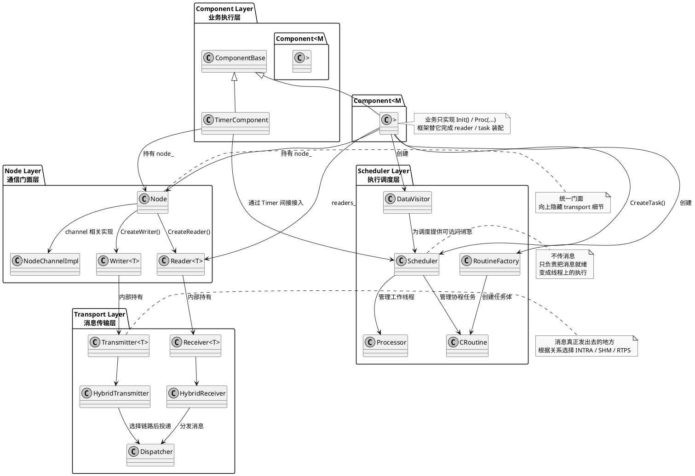

# Cyber 四层边界关系图：`component` / `node` / `transport` / `scheduler`

本文专门从**边界职责**的角度，把 `cyber/` 里最容易混在一起的四层拆开：

- `component`
- `node`
- `transport`
- `scheduler`

目标不是按目录枚举文件，而是回答三个更核心的问题：

1. 这四层各自负责什么？
2. 每一层大致由哪些关键类组合起来？
3. 它们之间是怎么建立关系的？

如果先给一句压缩结论，可以这样记：

> `component` 定义业务逻辑，`node` 提供通信门面，`transport` 负责真正传消息，`scheduler` 负责把业务逻辑调度到线程上执行。

---

## 1. 四层边界关系总图

先看整体 PlantUML 图，再回头逐层解释。



---

## 2. `component`：业务执行层

### 2.1 这一层负责什么

`component` 是最接近业务逻辑的一层。它解决的问题是：

> 业务代码收到输入以后，到底做什么？

典型职责包括：

- 读自己的配置
- 创建 writer
- 初始化内部算法对象
- 在 `Proc()` 里处理输入消息
- 产出新的业务消息

### 2.2 关键类组合

最重要的三个类是：

- `ComponentBase`
- `Component<M...>`
- `TimerComponent`

#### `ComponentBase`

共同底座，负责：

- 持有 `node_`
- 持有 `readers_`
- 加载 `config_file_path` / `flag_file_path`
- shutdown 时清理 reader 和 scheduler task

#### `Component<M...>`

消息驱动组件模板。业务类通常继承它，然后自己只实现：

- `Init()`
- `Proc(...)`

#### `TimerComponent`

定时驱动组件。不是等消息来了再跑，而是框架定时调用 `Proc()`。

### 2.3 它和其他层如何建立关系

`component` 不直接实现底层通信，也不直接管理线程池。它通过：

- `node_` 去创建 reader/writer
- `DataVisitor + RoutineFactory + Scheduler` 接入执行调度

所以这层最像“业务接口层”。

---

## 3. `node`：通信门面层

### 3.1 这一层负责什么

`node` 层解决的问题是：

> 业务组件如何以统一 API 方式创建 reader / writer / service / client？

它不负责业务逻辑，也不直接做最终传输，只负责给上层提供一个稳定门面。

### 3.2 关键类组合

这一层最值得记住的是：

- `Node`
- `NodeChannelImpl`
- `Reader<T>`
- `Writer<T>`

#### `Node`

是门面对象。业务代码最常见的接口就是：

- `CreateReader<T>()`
- `CreateWriter<T>()`

#### `NodeChannelImpl`

是 `Node` 在 channel 方向的内部实现。真正的 reader/writer 创建逻辑会落到这里。

#### `Reader<T>`

表示订阅端。它会：

- 订阅一个 channel
- 持有 `Receiver<T>`
- 缓存和观察消息
- 配合 component 和 scheduler 进入执行链

#### `Writer<T>`

表示发布端。它会：

- 持有 `Transmitter<T>`
- 在 `Write(msg)` 时把消息交给 transport 层发出去

### 3.3 它和其他层如何建立关系

`node` 层向上服务 `component`，向下连接 `transport`：

- `component` 调 `node_->CreateReader/Writer`
- `reader/writer` 再分别持有 `receiver/transmitter`

所以它像一个“中间适配器层”。

---

## 4. `transport`：消息传输层

### 4.1 这一层负责什么

`transport` 层解决的问题是：

> 一条消息从 writer 出去以后，怎样真正到达 reader？

它不关心业务 `Proc()`，也不关心 scheduler 怎么调度线程。它只负责传消息。

### 4.2 关键类组合

这一层可以先抓五类对象：

- `Transmitter<T>`
- `Receiver<T>`
- `HybridTransmitter`
- `HybridReceiver`
- `Dispatcher`

#### `Transmitter<T>`

发送端底座。`Writer<T>::Write()` 最终会把消息交给它。

#### `Receiver<T>`

接收端底座。`Reader<T>` 内部依赖它来接消息。

#### `HybridTransmitter` / `HybridReceiver`

这两个类负责根据运行关系选择实际路径，比如：

- 同进程：`INTRA`
- 同机跨进程：`SHM`
- 跨机：`RTPS`

#### `Dispatcher`

负责消息分发。收到 transport 层的数据后，继续往 reader 这边交付。

### 4.3 它和其他层如何建立关系

这层和 `node` 的关系最直接：

- `Writer<T>` 内部持有 `Transmitter<T>`
- `Reader<T>` 内部持有 `Receiver<T>`

然后 transport 再通过 dispatcher，把消息真正交付到 reader 侧。

---

## 5. `scheduler`：执行调度层

### 5.1 这一层负责什么

`scheduler` 解决的问题是：

> 消息已经到了，接下来由哪个线程/协程去执行业务逻辑？

它不搬消息，不创建 writer，不关心业务算法细节。它只负责“让逻辑在线程里跑起来”。

### 5.2 关键类组合

这一层建议先记住：

- `Scheduler`
- `Processor`
- `CRoutine`
- `RoutineFactory`
- `DataVisitor`

#### `Scheduler`

全局调度入口。负责：

- `CreateTask()`
- 管理协程任务
- 通知 processor 执行

#### `Processor`

真正的工作线程载体。内部有自己的 `std::thread`，负责跑调度循环。

#### `CRoutine`

协程任务对象。component 的业务执行逻辑最终通常会包装成它。

#### `RoutineFactory`

把 component 的回调逻辑包装成一个可创建 `CRoutine` 的工厂。

#### `DataVisitor`

reader 和 scheduler 之间的数据访问桥梁。它让 reader 收到的消息可以被调度器按框架方式消费。

### 5.3 它和其他层如何建立关系

普通 `Component<M>` 在 `Initialize()` 时会：

1. 创建 reader
2. 基于 reader 创建 `VisitorConfig`
3. 创建 `DataVisitor`
4. 创建 `RoutineFactory`
5. 调 `scheduler->CreateTask(...)`

所以 `scheduler` 和 `component` 的关系，不是直接“创建线程给 component”，而是：

> component 把自己的业务回调包装成 task，scheduler 再负责让 task 在线程上执行。

---

## 6. 四层之间如何建立关系：从初始化角度看

如果从 component 的初始化阶段看，这四层关系建立顺序可以写成：

```text
Component
  -> 创建 node_
  -> node 创建 Reader / Writer
  -> Reader 内部接到 Receiver
  -> Writer 内部接到 Transmitter
  -> Component 再基于 Reader 创建 DataVisitor
  -> Component 再创建 RoutineFactory
  -> Scheduler 创建任务
```

也就是说，初始化时同时发生了两条接线：

1. **通信接线**
`component -> node -> reader/writer -> transport`

2. **执行接线**
`component -> DataVisitor -> RoutineFactory -> scheduler`

这两条线必须同时成立，component 才算真正可运行。

---

## 7. 四层之间如何建立关系：从消息流角度看

如果从一条消息的生命周期看，可以写成：

```text
上游 component 的 Proc()
  -> writer_->Write(msg)
  -> Transmitter::Transmit(msg)
  -> transport 传递消息
  -> Receiver 收到消息
  -> Reader 接住消息
  -> DataVisitor 提供消息给调度器
  -> Scheduler 唤醒 task
  -> Processor 线程执行 CRoutine
  -> 下游 component 的 Process(msg)
  -> 下游 component 的 Proc(msg)
```

这条链最关键的分工是：

- `transport` 负责“消息怎么过来”
- `scheduler` 负责“消息到了之后谁来跑逻辑”

这也是很多人一开始最容易混的地方。

---

## 8. 用一句话分别总结四层

### `component`

> 负责定义业务逻辑本身。

### `node`

> 负责向业务层提供统一的 reader/writer 门面。

### `transport`

> 负责把消息从 writer 搬到 reader。

### `scheduler`

> 负责把就绪的业务逻辑调度到线程上执行。

---

## 9. 一句话总总结

如果把 `component / node / transport / scheduler` 四层关系压成一句话，可以这样记：

> `component` 通过 `node` 创建输入输出端点，`node` 底层依赖 `transport` 收发消息，而 `component` 再借助 `DataVisitor + Scheduler` 把自己的 `Proc()` 接到线程执行路径上。
