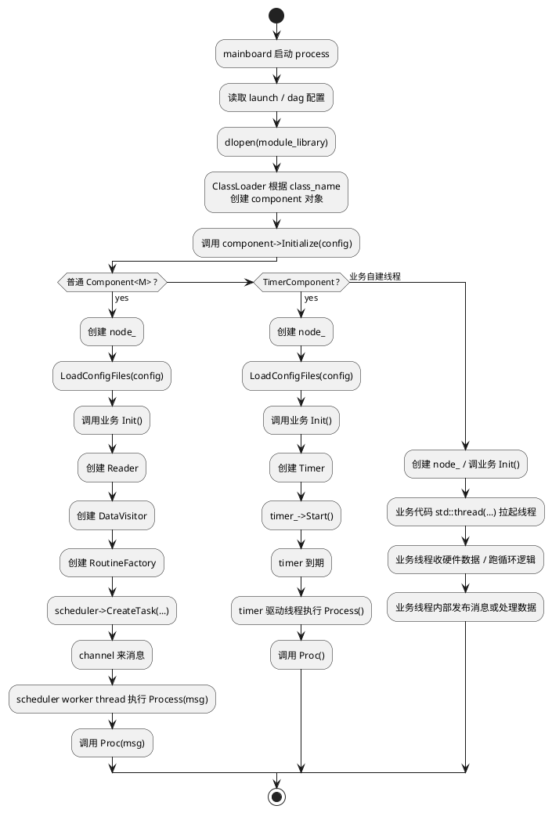

# 从 `dlopen` 到线程执行：CyberRT Component 运行链路详解

本文专门回答一个非常关键但也最容易模糊的问题：

> 一个 component 被 `mainboard` 通过动态库加载进来之后，它到底是怎么“跑到线程上”的？

很多时候我们容易把这件事想得过于简单，好像：

- `dlopen` 之后
- component 对象被创建
- 然后它就自动开始在某个线程里运行

但真实情况并不是这样。

更准确地说，`dlopen` 只负责把动态库装进进程地址空间，并让 class loader 能找到并实例化 component 类。真正让 component 进入“可执行状态”的，是后续这几步：

1. `mainboard` 根据 DAG 创建 component 对象
2. 调用 `Initialize()` 做装配
3. 按 component 类型把它接到：
   - scheduler 线程
   - timer 驱动线程
   - 或业务自己创建的线程
4. 消息或定时事件到达时，真正执行 `Proc()`

所以这篇文档的核心结论先提前说：

> `dlopen` 负责“加载类”，`Initialize()` 负责“接线”，真正的线程执行来自 scheduler、timer，或者业务自己创建的线程，而不是 `dlopen` 本身。

---

## 1. 先建立整体模型

如果把这条链压缩成一句话，可以先记成：

```text
mainboard 启动进程
  -> 读取 DAG
  -> dlopen 动态库
  -> class loader 创建 component 对象
  -> 调用 Initialize()
  -> 组件接入 reader / scheduler / timer / 业务线程
  -> 事件到来时执行 Proc()
```

这里最重要的是把“加载”与“运行”分开：

- `dlopen` 是加载阶段
- `Initialize()` 是装配阶段
- `Proc()` 真正在线程里跑，是执行阶段

这三个阶段对应的是完全不同的问题。

---

## 2. 第一阶段：`mainboard` 启动进程并读取 DAG

在 Apollo / CyberRT 里，操作系统真正跑起来的是一个 `mainboard` 进程。这个进程通常由 launch 配置定义，例如：

- `module`
- `dag_conf`
- `process_name`

也就是说，进程不是 component 自己拉起的，而是：

- launch 先定义一个启动单元
- `mainboard` 按这个单元启动对应 process
- 然后在这个进程里加载 DAG 里声明的 component

所以 component 从一开始就不是“独立程序”，而是：

> 被装进某个现有 `mainboard` 进程里的运行单元。

---

## 3. 第二阶段：`dlopen` 到底做了什么

`dlopen` 做的事其实很克制，它本身不关心 component 的 reader、writer、scheduler、timer，也不负责创建业务线程。

它主要做两件事：

1. 把 `.so` 动态库加载进当前进程地址空间
2. 让 class loader 能从这个库里找到已注册的 component 类

所以从语义上说：

- `dlopen` 解决的是“类从哪里来”
- 不解决“类怎么运行”

这也是为什么你不能把 `dlopen` 理解成“启动组件线程”的动作。

---

## 4. 第三阶段：class loader 如何找到 component 类

为什么 DAG 里只写了：

- `module_library`
- `class_name`

框架就能把对应组件对象创建出来？

原因在于 component 类最后通常都会写：

```cpp
CYBER_REGISTER_COMPONENT(SomeComponent)
```

这个宏会把业务类注册成 `ComponentBase` 的派生类。也就是说，动态库被加载后，class loader 能根据：

- 动态库路径
- 类名 `class_name`

去构造出真正的 component 对象。

所以这里的逻辑关系是：

```text
DAG class_name
  -> class loader 查注册表
  -> 创建 C++ component 对象
```

到这一步为止，component 对象只是“被实例化了”，但还没有接到 reader，也还没有进入线程执行。

---

## 5. 第四阶段：真正关键的是 `Initialize()`

component 对象被创建之后，框架接下来做的关键动作是：

```text
component->Initialize(config)
```

这一步才是真正把“一个普通 C++ 对象”变成“CyberRT 运行单元”的关键装配点。

对普通消息驱动组件来说，`Initialize()` 会负责：

1. 创建 `node_`
2. 加载配置文件和 flag 文件
3. 调业务自己的 `Init()`
4. 创建 `Reader`
5. 构造回调 `func`
6. 创建 `DataVisitor`
7. 创建 `RoutineFactory`
8. 调 `scheduler->CreateTask(...)`

所以要记住：

> `Initialize()` 不是普通初始化函数，而是 CyberRT 运行时装配函数。

没有它，component 只是一个被加载进进程的类；有了它，component 才真正被接上 reader、scheduler、timer 等运行基础设施。

---

## 6. 线程到底从哪里来：有三种来源

这是整篇文档最重要的一节。

component 被加载后，真正可能跑到的线程来源，通常有三类。

### 6.1 第一类：Scheduler 工作线程

这是最典型的一类，针对：

- `Component<M>`
- `Component<M0, M1>`
- 一般消息驱动组件

运行模型是：

1. `Initialize()` 创建 reader
2. `Initialize()` 创建 `DataVisitor`
3. `Initialize()` 创建 `RoutineFactory`
4. `scheduler->CreateTask(...)`
5. channel 上来消息
6. scheduler 唤醒对应 task
7. 某个 processor 线程执行 `Process(msg)`
8. `Process(msg)` 再调用 `Proc(msg)`

这意味着：

> 普通消息驱动 component 的 `Proc()`，默认不是在自己专属线程里跑，而是跑在 CyberRT scheduler 的工作线程上。

也就是说，不是“一个 component 对应一个线程”，而是“多个 component task 复用一组 scheduler worker threads”。

### 6.2 第二类：Timer 驱动线程 / 定时任务线程

这一类针对：

- `TimerComponent`

它不是靠 reader 来触发 `Proc()`，而是靠：

- `Timer`
- `TimingWheel`
- timer callback

典型链路是：

```text
Initialize(TimerComponentConfig)
  -> 创建 node_
  -> 调业务 Init()
  -> 创建 Timer
  -> timer_->Start()
  -> 周期到期
  -> Process()
  -> Proc()
```

所以 `TimerComponent` 的 `Proc()` 线程来源，不是普通 reader/scheduler 路径，而是 timer 驱动路径。

### 6.3 第三类：业务自己创建的线程

这类最容易在 driver 组件里看到。

例如 lidar 的驱动链里，`LidarDriverComponent` 自己不是靠 `Proc(msg)` 持续驱动主要工作，而是在内部 driver 初始化时，直接 `std::thread(...)` 拉起采集线程。

比如 Velodyne 典型地会有：

- `poll_thread_`
- `positioning_thread_`

这些线程负责：

- 收硬件 UDP 包
- 组装 `VelodyneScan`
- 通过 writer 发布原始 scan

所以这类 component 的真正工作线程，来自业务自己，而不是 scheduler 替它分配的 worker。

---

## 7. 这三类线程来源怎么区分

以后你看一个 component，可以直接用下面这个判断法。

### 7.1 看它继承什么

如果它继承：

- `Component<M>`

那大概率 `Proc(msg)` 是走 scheduler 工作线程。

如果它继承：

- `TimerComponent`

那大概率 `Proc()` 是走 timer 驱动线程。

### 7.2 看 `Init()` 里有没有显式创建线程

如果你在业务代码里看到：

- `std::thread(...)`

那说明它还有一类“业务自己开的线程”。

也就是说，一个 component 甚至可能同时涉及：

- scheduler 线程
- 业务线程

只不过它们负责的工作阶段不同。

---

## 8. 用 `VelodyneConvertComponent` 对照：它的线程来自哪里

`VelodyneConvertComponent` 是标准消息驱动组件：

```cpp
class VelodyneConvertComponent : public Component<VelodyneScan>
```

所以它的典型运行链是：

1. 被 class loader 创建对象
2. 调用 `Component<VelodyneScan>::Initialize(config)`
3. 创建 `Reader<VelodyneScan>`
4. 创建 `DataVisitor`
5. 创建 `RoutineFactory`
6. 注册 scheduler task
7. `/apollo/sensor/.../Scan` 上来消息
8. 某个 scheduler processor 线程执行 `Proc(scan_msg)`

所以：

> `VelodyneConvertComponent::Proc()` 的线程来源，通常是 scheduler 的 worker thread。

它自己并不负责创建采集线程。

---

## 9. 用 `LidarDriverComponent` 对照：它的线程来自哪里

`LidarDriverComponent` 更像一个“驱动启动器”。它在初始化阶段会拉起底层 driver，而底层 driver 里往往直接创建自己的线程。

例如 Velodyne driver 典型会拉起：

- firing data 采集线程
- positioning data 采集线程

这些线程持续做：

- 收硬件数据
- 组装 raw scan
- 写到 `Scan` channel

所以在这条链里：

- `LidarDriverComponent` 主要依赖业务线程
- `VelodyneConvertComponent` 主要依赖 scheduler 线程
- `CompensatorComponent` 也主要依赖 scheduler 线程

这就解释了为什么“同一个 process 内的多个 component”可以各自处于不同的线程来源模型中。

---

## 10. 从 `dlopen` 到线程执行的完整运行链

如果把前面所有内容压缩成一条完整运行链，可以写成：

```text
mainboard 启动进程
  -> 读取 DAG
  -> dlopen 动态库
  -> class loader 根据 class_name 创建 component 对象
  -> 调用 component->Initialize(config)
  -> 根据 component 类型接入运行基础设施：
       - 普通 Component<M> -> Reader + DataVisitor + Scheduler Task
       - TimerComponent -> Timer
       - Driver 类组件 -> 业务自己开的线程
  -> 事件到来：
       - channel 消息
       - timer 到期
       - 采集线程收到硬件数据
  -> 最终调用对应的业务逻辑
       - Proc(msg)
       - Proc()
       - 或 driver 内部循环逻辑
```

所以这里真正的分界线是：

- `dlopen`：把类装进来
- `Initialize()`：把类接上运行时基础设施
- 线程执行：由 scheduler / timer / 业务线程负责

---

## 11. PlantUML 总图：`dlopen` 到线程执行

下面这张图把完整链路画出来。



---

## 12. 这张图里最关键的认识

### 12.1 `dlopen` 不等于“开始在线程里跑”

`dlopen` 只是：

- 加载动态库
- 让类可被实例化

它本身并不决定线程模型。

### 12.2 `Initialize()` 才是“接线阶段”

真正决定 component 怎么被接到：

- reader
- scheduler
- timer
- 业务线程

的是 `Initialize()` 以及业务 `Init()` 中的后续逻辑。

### 12.3 不同 component 可以有不同线程来源

即使它们在同一个 process 里，也完全可能：

- 有的跑在 scheduler worker 上
- 有的跑在 timer 路径上
- 有的自己开线程

所以“同进程”不等于“同线程模型”。

---

## 13. 你现在可以怎么判断一个 component 最终跑在哪类线程上

最实用的方法有 3 个。

1. 看继承关系
- `Component<M>`：优先怀疑是 scheduler 线程
- `TimerComponent`：优先怀疑是 timer 驱动线程

2. 看 `Initialize()` / `Init()` 里有没有 `CreateTask` 相关链路
- 如果走 `Reader + DataVisitor + RoutineFactory + CreateTask`，那就是 scheduler 路径

3. 看业务代码里有没有显式 `std::thread`
- 如果有，那至少还有业务线程参与运行

---

## 14. 一句话总结

如果把“从 `dlopen` 到线程执行”压成一句话，可以这样记：

> `dlopen` 负责把 component 类加载进进程，`Initialize()` 负责把它接到 reader / scheduler / timer / 业务线程上，而真正执行 `Proc()` 的线程来源，取决于它是普通消息组件、定时组件，还是内部自己开线程的驱动组件。
