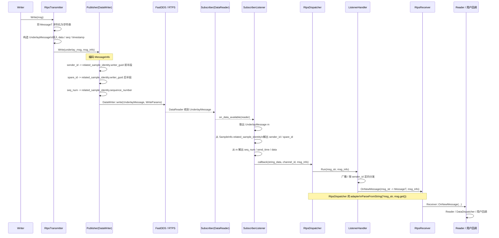

# CyberRT 基于 FastRTPS / FastDDS 的通信实现学习笔记

本文面向**没有接触过 RTPS / DDS** 的读者，目标是帮助你先建立直观认识，再顺着 CyberRT 的源码看清楚：

- RTPS / DDS 在这套系统里扮演什么角色
- `RtpsTransmitter` 如何发送消息
- `MessageInfo` 如何被编码到 DDS 元信息里
- `SubscriberListener` 如何在接收端把它解回来
- `RtpsDispatcher -> ListenerHandler -> RtpsReceiver -> Reader` 如何完成本进程内分发

---

## 1. 先建立最基本的认知：RTPS / DDS 是什么

先只记一句话：

> **DDS / RTPS 可以理解成一套“发布-订阅式中间件协议”。**

在 CyberRT 这套实现里：

- **DDS / RTPS** 负责网络传输
- **CyberRT** 在它上面再包了一层自己的消息头和分发逻辑

所以你现在看到的 RTPS 通信，不是“裸 DDS”，而是：

```text
CyberRT 业务消息
  -> CyberRT 封装
  -> FastDDS / RTPS 发送
  -> FastDDS / RTPS 接收
  -> CyberRT 解封装
  -> 分发给 Reader
```

---

## 2. RTPS 链路中的核心类

### 发送侧

- `RtpsTransmitter`：CyberRT 的 RTPS 发送器
  `cyber/transport/transmitter/rtps_transmitter.h:39`
- `Publisher`：对 FastDDS `DataWriter` 的封装
  `cyber/transport/rtps/publisher.h:42`
- `UnderlayMessage`：真正发到 DDS Topic 上的数据类型
  `cyber/transport/rtps/underlay_message.h:40`

### 接收侧

- `Subscriber`：对 FastDDS `DataReader` 的封装
  `cyber/transport/rtps/subscriber.h:45`
- `SubscriberListener`：DDS 到消息时触发的 listener
  `cyber/transport/dispatcher/subscriber_listener.h:43`
- `RtpsDispatcher`：把收到的 RTPS 数据分发给本进程 listener
  `cyber/transport/dispatcher/rtps_dispatcher.h:49`
- `RtpsReceiver`：把自己注册到 `RtpsDispatcher`
  `cyber/transport/receiver/rtps_receiver.h:29`

---

## 3. RTPS 层真正发送的数据是什么

### 3.1 发送的不是业务消息本体

RTPS 层统一发送的是：

- `UnderlayMessage`
  `cyber/transport/rtps/underlay_message.h:40`

而且 Topic 的 data type 也明确配置为：

- `"UnderlayMessage"`
  `cyber/transport/qos/qos_filler.cc:40`
  `cyber/transport/qos/qos_filler.cc:127`
  `cyber/transport/rtps/attributes_filler.cc:37`
  `cyber/transport/rtps/attributes_filler.cc:124`

因此，RTPS 层的传输抽象是：

> **先把业务消息 `MessageT` 变成统一载体 `UnderlayMessage`，再交给 DDS 发送。**

---

### 3.2 如何理解 `UnderlayMessage`

你可以先把它理解成一个“底层快递盒子”：

- 里面装着业务消息序列化后的正文
- 还会携带一些 CyberRT 需要的字段，比如序号、时间戳等

也就是说：

```text
业务消息 MessageT
  -> 序列化成 bytes / string
  -> 装进 UnderlayMessage
  -> 由 DDS DataWriter 发出去
```

---

## 4. RTPS 发送侧主链路

### 4.1 Transport 创建 `RtpsTransmitter`

入口在：

- `cyber/transport/transport.h:107-110`

```cpp
transmitter =
    std::make_shared<RtpsTransmitter<M>>(modified_attr, participant());
```

说明 `RtpsTransmitter` 内部会持有 DDS participant，用于创建 publisher / topic / datawriter。

---

### 4.2 `RtpsTransmitter` 先构造 `UnderlayMessage`

从搜索结果能看到：

- `cyber/transport/transmitter/rtps_transmitter.h:128`
  出现了 `UnderlayMessage m;`

这说明发送流程里会：

1. 把业务消息 `MessageT` 序列化
2. 构造 `UnderlayMessage`
3. 再交给 `Publisher` 发出去

---

### 4.3 `Publisher::Write()` 调用 FastDDS DataWriter

关键函数在：

- `cyber/transport/rtps/publisher.cc:75`

```cpp
bool Publisher::Write(const UnderlayMessage& msg, const MessageInfo& msg_info,
                      bool is_topo_msg)
```

最终真正发出去的是：

- `cyber/transport/rtps/publisher.cc:95-96`

```cpp
return writer_->write(
    reinterpret_cast<void*>(const_cast<UnderlayMessage*>(&msg)), wparams);
```

所以发送端在 DDS 看来，发出去的是：

- 一个 `UnderlayMessage`
- 外加一份 `WriteParams wparams`

---

## 5. `MessageInfo` 在 RTPS 里怎么编码

这是整条链路里最重要的点之一。

### 5.1 `MessageInfo` 不是直接塞进业务 data

在 RTPS 发送里，CyberRT 会把 `MessageInfo` 的部分字段编码进 DDS 的：

- `related_sample_identity`

见：

- `cyber/transport/rtps/publisher.cc:82-93`

```cpp
eprosima::fastrtps::rtps::WriteParams wparams;

char* ptr =
    reinterpret_cast<char*>(&wparams.related_sample_identity().writer_guid());

memcpy(ptr, msg_info.sender_id().data(), ID_SIZE);
memcpy(ptr + ID_SIZE, msg_info.spare_id().data(), ID_SIZE);

wparams.related_sample_identity().sequence_number().high =
    (int32_t)((msg_info.seq_num() & 0xFFFFFFFF00000000) >> 32);
wparams.related_sample_identity().sequence_number().low =
    (int32_t)(msg_info.seq_num() & 0xFFFFFFFF);
```

---

### 5.2 映射关系

可以直接记成：

#### `sender_id`
放进：

```text
related_sample_identity.writer_guid 前半段
```

#### `spare_id`
放进：

```text
related_sample_identity.writer_guid 后半段
```

#### `seq_num`
放进：

```text
related_sample_identity.sequence_number
```

所以 RTPS 这套实现相当于“借用 DDS sample identity 这块元信息，承载 CyberRT 的消息头信息”。

---

### 5.3 `send_time` 从哪里走

`send_time` 不在这段 `related_sample_identity` 里，而是由发送端写入 `UnderlayMessage`，接收端再从 `UnderlayMessage` 里拿出来。

后续 `RtpsDispatcher` 会用它统计传输延迟：

- `cyber/transport/dispatcher/rtps_dispatcher.h:92-103`
- `cyber/transport/dispatcher/rtps_dispatcher.h:120-132`

---

## 6. RTPS 接收侧主链路

### 6.1 `Subscriber` 封装 DDS DataReader

定义在：

- `cyber/transport/rtps/subscriber.h:45`

它内部负责：

- DataReader
- Topic
- SubscriberListener
- QoS 配置

---

### 6.2 数据到达后进入 `SubscriberListener::on_data_available`

定义在：

- `cyber/transport/dispatcher/subscriber_listener.cc:32`

这是 RTPS 接收的第一入口。

---

### 6.3 `on_data_available()` 先拿到 `UnderlayMessage`

代码：

- `cyber/transport/dispatcher/subscriber_listener.cc:39-43`

```cpp
eprosima::fastdds::dds::SampleInfo m_info;
UnderlayMessage m;

while (reader->take_next_sample(reinterpret_cast<void*>(&m), &m_info) ==
       ...RETCODE_OK) {
```

所以 DDS 接收侧拿到的是：

- `UnderlayMessage m`
- `SampleInfo m_info`

你可以理解成：

- `m` = 消息正文载体
- `m_info` = DDS 附带的元信息

---

## 7. 接收端如何解码 `MessageInfo`

### 7.1 从 `SampleInfo.related_sample_identity` 中拆出 sender/spare

代码：

- `cyber/transport/dispatcher/subscriber_listener.cc:45-53`

```cpp
char* ptr = reinterpret_cast<char*>(
    &m_info.related_sample_identity.writer_guid());

Identity sender_id(false);
sender_id.set_data(ptr);
msg_info_.set_sender_id(sender_id);

Identity spare_id(false);
spare_id.set_data(ptr + ID_SIZE);
msg_info_.set_spare_id(spare_id);
```

这正好和发送端 `Publisher::Write()` 里的 `memcpy(ptr, ...)` / `memcpy(ptr + ID_SIZE, ...)` 一一对应。

---

### 7.2 从 `UnderlayMessage` 中取出 `seq_num / send_time`

代码：

- `cyber/transport/dispatcher/subscriber_listener.cc:55-56`

```cpp
msg_info_.set_seq_num(m.seq());
msg_info_.set_send_time(m.timestamp());
```

这说明接收端的 `MessageInfo` 是“重新拼出来的”，来源分成两部分：

- `sender_id / spare_id`：来自 DDS `SampleInfo`
- `seq_num / send_time`：来自 `UnderlayMessage`

---

### 7.3 将正文作为 `std::string` 上交

代码：

- `cyber/transport/dispatcher/subscriber_listener.cc:58`

```cpp
callback_(std::make_shared<std::string>(m.data()), channel_id, msg_info_);
```

说明 `SubscriberListener` 并不会直接还原成业务 `MessageT`，而是先把 `UnderlayMessage.data()` 里的内容提出来，作为：

- `std::string`
- `MessageInfo`
- `channel_id`

交给上层 `RtpsDispatcher`。

所以此时链路是：

```text
UnderlayMessage
  -> string_data + MessageInfo
```

---

## 8. `RtpsDispatcher` 如何继续分发

### 8.1 `RtpsReceiver` 把自己挂到 `RtpsDispatcher`

代码：

- `cyber/transport/receiver/rtps_receiver.h:63-65`

```cpp
dispatcher_->AddListener<M>(
    this->attr_, std::bind(&RtpsReceiver<M>::OnNewMessage, this,
                           std::placeholders::_1, std::placeholders::_2));
```

---

### 8.2 `RtpsDispatcher::AddListener<M>()` 会包一层 adapter

代码：

- `cyber/transport/dispatcher/rtps_dispatcher.h:85-109`

```cpp
auto listener_adapter = [listener, self_attr](
                            const std::shared_ptr<std::string>& msg_str,
                            const MessageInfo& msg_info) {
  auto msg = std::make_shared<MessageT>();
  RETURN_IF(!message::ParseFromString(*msg_str, msg.get()));
  ...
  listener(msg, msg_info);
};

Dispatcher::AddListener<std::string>(self_attr, listener_adapter);
AddSubscriber(self_attr);
```

这说明：

1. `RtpsDispatcher` 底层实际注册的是 `std::string` listener
2. adapter 再负责把 `std::string` 反序列化成业务 `MessageT`

所以 RTPS 链路可以概括成：

```text
DDS -> UnderlayMessage -> std::string -> MessageT
```

---

### 8.3 同时做传输延迟统计

同一个 adapter 里还会基于 `msg_info.send_time()` 做统计：

- `cyber/transport/dispatcher/rtps_dispatcher.h:92-103`

```cpp
uint64_t recv_time = Time::Now().ToNanosecond();
uint64_t send_time = msg_info.send_time();
...
statistics::Statistics::Instance()->SamplingTranLatency<uint64_t>(
    self_attr, diff);
statistics::Statistics::Instance()->SetProcStatus(self_attr, recv_time);
```

所以 `RtpsDispatcher` 不只是做分发，还顺手做：

- transport latency 统计
- process status 记录

---

## 9. Dispatcher / ListenerHandler / Receiver 这一段

这部分和 SHM / Intra 的思想是一样的。

### 9.1 `Dispatcher` 维护 `channel_id -> ListenerHandler`

见：

- `cyber/transport/dispatcher/dispatcher.h:83`
- `cyber/transport/dispatcher/dispatcher.h:95-112`

---

### 9.2 `ListenerHandler::Run()` 做广播和定向分发

见：

- `cyber/transport/message/listener_handler.h:163-173`

```cpp
signal_(msg, msg_info);
uint64_t oppo_id = msg_info.sender_id().HashValue();
...
(*signals_[oppo_id])(msg, msg_info);
```

也就是：

1. 先广播给普通 listener
2. 如有需要，再按 `sender_id` 做定向分发

---

### 9.3 最终进入 `Receiver::OnNewMessage()`

见：

- `cyber/transport/receiver/receiver.h:61-65`

```cpp
msg_listener_(msg, msg_info, attr_);
```

然后继续进入：

- `Reader`
- `DataDispatcher`
- `DataVisitor`
- 用户回调

---

## 10. RTPS 端到端完整调用链

### 发送侧

```text
Writer::Write()
  -> Transmitter::Transmit(msg)
  -> RtpsTransmitter::Transmit(msg, msg_info)
  -> 构造 UnderlayMessage
  -> Publisher::Write(underlay_msg, msg_info)
  -> 将 sender_id / spare_id / seq_num 编进 WriteParams.related_sample_identity
  -> DDS DataWriter::write(...)
```

---

### 接收侧

```text
DDS DataReader 收到 UnderlayMessage
  -> SubscriberListener::on_data_available()
  -> 从 SampleInfo.related_sample_identity 拆 sender_id / spare_id
  -> 从 UnderlayMessage 拿 seq_num / send_time / data
  -> callback_(string_data, channel_id, msg_info)

  -> RtpsDispatcher::OnMessage(...)
  -> ListenerHandler<std::string>::Run(...)
  -> adapter: ParseFromString(*msg_str, msg.get())
  -> RtpsReceiver::OnNewMessage(msg, msg_info)
  -> Receiver::OnNewMessage(...)
  -> 后续 Reader / 用户回调
```

---

## 11. RTPS 专属时序图



---

## 12. 用“快递系统”类比帮助理解

如果你完全没接触过 DDS，可以用这个类比：

### 发送端

- 业务消息 `MessageT`：你要寄的物品
- `UnderlayMessage`：快递盒子
- `MessageInfo`：快递单上的附加信息
- DDS / RTPS：运输网络

### 接收端

- `SubscriberListener`：快递站点的收件员
- `RtpsDispatcher + ListenerHandler`：内部派送中心
- `Reader / 用户回调`：最终收件人

所以整条链路可以理解成：

```text
物品(MessageT)
  -> 装箱(UnderlayMessage)
  -> 写快递单(MessageInfo 编码)
  -> 快递网络(DDS)
  -> 收件员(SubscriberListener)拆单
  -> 派送中心(RtpsDispatcher)分发
  -> 收件人(Reader / 用户回调)
```

---

## 13. 现在最值得先记住的 3 个事实

### 13.1 RTPS 层真正发的是 `UnderlayMessage`

不是直接发业务消息 `MessageT`。

---

### 13.2 `MessageInfo` 被拆开放

- `sender_id / spare_id`：放进 DDS `related_sample_identity`
- `seq_num / send_time`：从 `UnderlayMessage` 里取

所以 `MessageInfo` 不是原封不动整体塞过去，而是按字段分散承载。

---

### 13.3 接收端不是一步拿到 `MessageT`

中间会经过：

```text
UnderlayMessage -> std::string -> MessageT
```

---

## 14. 最简记忆版

你可以先背这个：

```text
MessageT
  -> RtpsTransmitter 序列化
  -> UnderlayMessage
  -> Publisher 用 FastDDS 发出去
  -> MessageInfo 编进 related_sample_identity
  -> SubscriberListener 收到
  -> 拆出 string + MessageInfo
  -> RtpsDispatcher 分发
  -> ParseFromString 还原 MessageT
  -> RtpsReceiver / Reader / 用户回调
```

---

## 15. 建议后续阅读顺序

如果你要继续跟源码，建议按这个顺序打开文件：

1. `cyber/transport/transmitter/rtps_transmitter.h`
2. `cyber/transport/rtps/publisher.h`
3. `cyber/transport/rtps/publisher.cc`
4. `cyber/transport/rtps/underlay_message.h`
5. `cyber/transport/receiver/rtps_receiver.h`
6. `cyber/transport/rtps/subscriber.h`
7. `cyber/transport/dispatcher/subscriber_listener.h`
8. `cyber/transport/dispatcher/subscriber_listener.cc`
9. `cyber/transport/dispatcher/rtps_dispatcher.h`
10. `cyber/transport/message/listener_handler.h`

---

## 16. 最终总结

一句话总结这条 RTPS 链路：

> CyberRT 的 FastRTPS / FastDDS 通信实现，本质上是：**把业务消息先封装成 `UnderlayMessage` 交给 DDS 传输，同时把 `MessageInfo` 编进 DDS sample identity / underlay 字段；接收端再拆出来，经由 `RtpsDispatcher` 和 `ListenerHandler` 还原并分发给业务接收者。**
